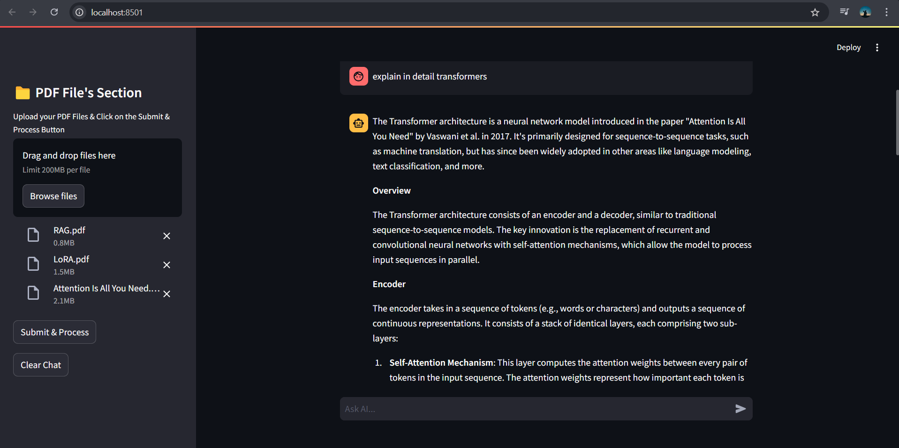

# Multi-Document Chatbot

## 📋 Project Overview
The **Multi-Document Chatbot** is an advanced conversational AI tool designed to handle and answer queries across multiple PDF documents. The bot leverages the power of vector stores to efficiently retrieve and provide contextually relevant answers. This project integrates various technologies including **Streamlit** for the UI, **Cohere** for embeddings, and **LangChain** to manage the interaction logic.

---

## 💻 Tech Stack
- **Python**
- **Streamlit**
- **LangChain**
- **Chroma** (Vector Store)
- **Cohere** (Embedding Model)

---

## ⚙️ Features
- Upload and process multiple PDF documents.
- Efficiently retrieve relevant answers from large text chunks.
- Interactive chat interface built using **Streamlit**.
- Persistent vector store using **Chroma** for quick retrieval.

---

## 🛠 Setup Instructions

### Prerequisites
Ensure you have the following installed:
- Python 3.8+
- Miniconda or Anaconda (optional but recommended)

### Installation Steps
1. Clone the repository:
   ```bash
   git clone https://github.com/AttifKhan/Multi-Document-Chatbot.git
   cd multidocument-chatbot
   ```
2. Create a virtual environment and activate it:
   ```bash
   conda create -n multidoc python=3.8
   conda activate multidoc
   ```
3. Install the required packages:
   ```bash
   pip install -r requirements.txt
   ```
4. Set up your `config.json` file to include your API keys:
   ```json
   {
     "groq_api_key": "your-groq-api-key",
     "cohere_api_key": "your-cohere-api-key"
   }
   ```

### Running the App
```bash
streamlit run main.py
```

---

## 🧩 How It Works
1. **PDF Upload**: Upload one or more PDF documents via the interface.
2. **Text Processing**: The bot extracts text from the uploaded PDFs.
3. **Vectorization**: The extracted text is split into chunks and stored in a **Chroma vector store**.
4. **Query Handling**: Users can ask questions in the chat interface, and the bot retrieves relevant text chunks to provide answers.

---


---

## 🖼 User Interface Snapshot
Below is a snapshot of the chat interface:





---

## 📂 Project Structure
```
multidocument-chatbot/
├── main.py
├── vectorize_documents.py
├── requirements.txt
├── config.json
├── assets/
│   └── interface-snapshot.png
└── README.md
```

---

## 🔧 Customization
Feel free to customize the chatbot's behavior by modifying the `main.py` and `vectorize_documents.py` files. You can adjust the chunk size, overlap, embedding model, and retrieval strategy.

---

## 🚀 Future Enhancements
- Add support for more file formats (e.g., Word, TXT).
- Improve the UI for better user experience.
- Implement user authentication.

---

## 📄 License
This project is licensed under the MIT License. See the `LICENSE` file for more details.

---

## 🙌 Acknowledgments
- **Cohere** for providing the embedding model.
- **LangChain** for the conversational logic.
- **Streamlit** for making it easy to build web apps in Python.

---

## 📞 Contact
For any questions or feedback, feel free to reach out:
- **Your Name**: [attifkhan634@gmail.com]
- **LinkedIn**: [Attif Khan](https://www.linkedin.com/in/attifkhan/)

